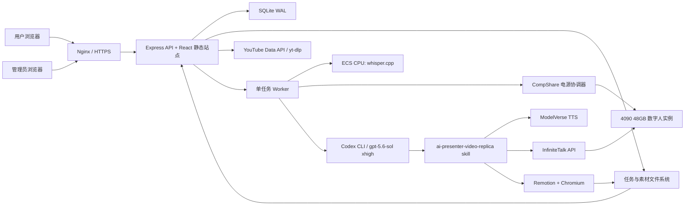
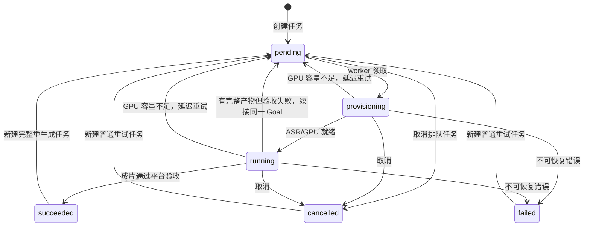

# AI 口播工厂开发与运维文档

> 文档版本：1.0<br>
> 对应应用版本：`ai-presenter-platform@0.1.0`<br>
> 最后核对：2026-07-23<br>
> 生产代码目录：`/opt/ai-presenter-platform`<br>
> 生产数据目录：`/var/lib/ai-presenter/data`

本文是当前 AI 口播工厂的开发、部署和运维交接文档。内容以仓库现有实现为准，不包含任何真实访问口令、API Key 或私钥。`server/config.ts`、`server/index.ts` 和部署脚本仍是配置与接口行为的最终事实来源。

## 1. 项目定位

平台把“主题、文案或参考视频”转换为可发布的 AI 数字人口播视频，并统一处理：

- 主题创作、已有文案、完整复刻和精简复刻；
- 人物形象、克隆音色、整段旁白和素材库；
- YouTube 热门视频搜索、筛选、导入与原链接跳转；
- 原片 ASR、文案重构、英文发音预检、字幕时间轴；
- CompShare GPU 按小时启停；
- Codex 单会话编排、InfiniteTalk 口型生成、Remotion 合成；
- 成片、封面、标题、描述和多层质量验收；
- 用户任务时间线和管理员监控台。

当前生产架构是单节点 Web/API + SQLite + 单 worker，GPU 数字人服务运行在独立 CompShare 实例。它适合串行、长耗时、重产物的视频任务，不是多 worker 分布式架构。

## 2. 系统架构



### 2.1 组件职责

| 组件 | 代码位置 | 职责 |
| --- | --- | --- |
| API 与认证 | `server/index.ts` | 路由、会话、上传、限流、SSE、产物下载 |
| 配置 | `server/config.ts` | 环境变量读取、默认值、生产配置硬校验 |
| 数据层 | `server/db.ts` | SQLite 表、任务队列、事件、运行状态、素材库 |
| Worker | `server/worker.ts` | 串行领取任务、ASR、GPU、Codex、自动恢复 |
| Codex 执行器 | `server/codex-runner.ts` | CLI 调用、Goal 续接、进度识别、产物硬验收 |
| Prompt | `server/prompt.ts` | 将任务参数和质量合同注入 Codex |
| GPU 电源 | `server/power-coordinator.ts` | 启停、健康检查、一小时计费窗口 |
| CompShare 客户端 | `server/compshare.ts` | 签名调用实例查询、启动与停止接口 |
| 美国节点探测 | `server/codex-proxy.ts` | 每次 Codex 启动前遍历美国节点并探活 |
| 原片 ASR | `server/asr.ts` | FFmpeg 抽音频、whisper.cpp 带时间戳转写 |
| YouTube | `server/youtube.ts` | 搜索、服务端筛选、排序、导入和落盘 |
| 重试 | `server/retry.ts` | 普通重试、完整重生成、内部视觉返修构建 |
| 用户事件过滤 | `server/public-events.ts` | 隐藏工具命令和内部细节，保留产品进度 |
| 用户前端 | `web/src/App.tsx` | 创建任务、素材选择、搜索导入、进度、下载 |
| 管理前端 | `web/src/AdminApp.tsx` | 队列、实例、指标、任务日志和控制 |
| 生成规范 | `deploy/ai-presenter-video-replica/` | 视频生成 skill、质量规范和辅助脚本 |

## 3. 目录结构

### 3.1 仓库

```text
ai-presenter-platform/
├── server/                     # Express、队列、GPU、Codex、校验
├── web/                        # React/Vite 前端
│   ├── src/
│   └── dist/                   # pnpm run build 生成
├── tests/                      # Vitest 单元与契约测试
├── scripts/                    # 运维/实例查询脚本
├── deploy/
│   ├── ai-presenter.service
│   ├── nginx.conf
│   ├── bootstrap-linux.sh
│   ├── install-remotion-runtime.sh
│   ├── install-whisper-runtime.sh
│   ├── install-ytdlp.sh
│   ├── codex-modelverse.toml
│   └── ai-presenter-video-replica/
├── docs/DEVELOPMENT.md
├── .env.example
├── package.json
└── README.md
```

### 3.2 生产服务器

```text
/opt/ai-presenter-platform/                     # 应用代码
/etc/ai-presenter-platform.env                  # systemd 环境，600 权限
/etc/systemd/system/ai-presenter.service         # systemd 单元
/etc/nginx/conf.d/ai-presenter.conf              # HTTPS 反向代理
/var/lib/ai-presenter/
├── .codex/config.toml                           # Codex provider 配置
├── .codex/skills/ai-presenter-video-replica/    # 生产 skill
├── runtime/
│   ├── whisper/                                 # whisper-cli 与模型
│   ├── remotion-4.0.490/                        # 共享 node_modules
│   └── fonts/                                   # Noto Sans CJK SC
└── data/
    ├── platform.sqlite                          # 主数据库
    ├── jobs/<job-id>/                           # 每个任务的输入、过程与输出
    ├── presenter-library/<asset-id>/             # 保存的形象/声音
    ├── youtube-imports/<import-id>/              # YouTube 临时导入
    └── incoming/                                # Multer 临时上传
```

生产应用必须由 `presenter:presenter` 拥有和运行。不要用 root 在 `data/jobs/<job-id>` 中手工创建文件；否则 worker 可能因 `EACCES` 无法续写。执行过 root 级复制后要重新确认归属。

## 4. 技术栈与运行要求

- Node.js 22 或更高；项目使用 ESM 和内置 `node:sqlite`。
- TypeScript 5.9、Express 5、React 19、Vite 7、Vitest 3。
- FFmpeg/ffprobe。
- Codex CLI 0.144.4 或更高。
- Python 3.11，用于生成 skill 的辅助脚本。
- whisper.cpp，用于 ECS CPU 转写和旁白时间轴。
- Headless Chromium、Noto Sans CJK SC 字体、共享 Remotion runtime。
- `yt-dlp`，用于 YouTube 回退搜索和下载。
- CompShare 4090 48GB 实例，提供 InfiniteTalk Gradio/API 服务。

前端构建输出在 `web/dist`，Express 在生产模式下直接提供静态文件和 SPA fallback。Nginx 只做 TLS、上传尺寸和长连接反向代理。

## 5. 核心领域模型

### 5.1 任务模式

| 字段 | 值 | 行为 |
| --- | --- | --- |
| `mode` | `topic` | 根据主题生成口播文案和视频 |
| `mode` | `script` | 根据用户已有文案生成视频 |
| `mode` | `clone` | 先转写参考视频，再完整或精简复刻 |
| `replicaMode` | `exact` | 尽量完整保留观点、顺序和时长；原片最长 1800 秒 |
| `replicaMode` | `condensed` | 允许删除次要观点和展开内容，保留核心观点、完整开场和结束 |

非复刻任务的 `replicaMode` 会归一化为 `condensed`。完整复刻提交时，服务端使用 ffprobe 的原片真实时长覆盖前端时长，避免前端参数造成错误压缩。

### 5.2 画幅与风格

画幅支持 `16:9`、`9:16`、`1:1`。风格是字符串，由前端选项和生成 skill 联合约束。`真人主画面·悬浮组件` 是特殊构图：必须上传或选择保存的人物图片；该图片是人物身份的唯一来源，数字人是主画面，信息组件悬浮在人物周围。

### 5.3 声音模式

| 值 | 输入 | 行为 |
| --- | --- | --- |
| `original_clone` | 参考视频 | 从原片提取 5–30 秒干净人声，克隆音色后重新生成旁白 |
| `uploaded_reference` | 5–30 秒音频 | 只作为克隆音色参考，不把该音频直接当口播 |
| `uploaded_audio` | 最长 180 秒完整音频 | 直接作为唯一最终旁白，不 TTS、不变速、不拉伸 |
| `system_voice` | 无额外音频 | 使用系统 TTS 音色生成旁白 |

完整复刻选择 `uploaded_audio` 时，音频时长必须与原片足够接近，容差为至少 5 秒或原片时长的 15%。

### 5.4 状态机



服务启动时会将遗留的 `provisioning` 和 `running` 任务恢复为 `pending / 等待恢复 / 2%`。状态恢复不等于清空生成检查点。

## 6. 一次任务的完整链路

1. API 校验字段、文件类型、媒体时长和版权确认。
2. 上传文件移入 `data/jobs/<id>/assets`；素材库和 YouTube 导入会复制快照，不引用可变原文件。
3. SQLite 写入任务和 `queued` 事件。
4. 单 worker 按创建时间领取最早的 `pending` 任务。
5. 复刻任务先在 ECS CPU 上抽取 16 kHz 单声道 WAV，并由 whisper.cpp 写出带时间戳转写；此时不需要启动 GPU。
6. 电源协调器确认 CompShare 实例状态；必要时启动或恢复数字人服务。
7. worker 生成强约束 prompt，启动 Codex CLI。若启用了代理，每次启动前只遍历并探测美国节点。
8. Codex 在同一 Goal 中执行视频生成 skill：分析、文案、发音、TTS、时间轴、InfiniteTalk、Remotion、封面和自检。
9. `CodexRunner` 独立读取产物清单并做媒体、音频、字幕、证据、画面和回执硬验收。
10. 通过后写入 `succeeded` 和成片路径；前端开放成片、封面、标题和描述。
11. 如果 `final.mp4` 与 `result.json` 已存在但平台验收未通过，任务回到 `pending`，并在同一 Goal 中带着验收反馈修复，不会立刻宣告最终失败。
12. 到一小时计费边界时，若没有活跃任务则关闭 GPU；有任务则顺延一个窗口。

GPU 容量不足（包括错误码 `226604`）使用 30、60、120、240、300 秒封顶的指数退避，不立即把任务标记失败。

## 7. 视频生成质量合同

### 7.1 文案与开闭场

- 先确定唯一 `final_script.txt`，再生成任何最终旁白与画面。
- 精简复刻可以丢弃次要信息，但保留内容必须能回到原片证据，且顺序不能颠倒。
- 开场白和结束语必须完整、有网感；标题、描述和封面也要与成片主题一致。
- 结束语可以自然总结或给出行动建议，但禁止“评论区扣 1”“不点赞就错过”等欺骗互动。
- 完整复刻按原片内容和时长处理，不受旧版 60/120 秒摘要约束。

### 7.2 英文与缩写发音

只要文案包含拉丁字母、缩写、产品名、模型名或版本号，就必须完成以下链路：

1. `pronunciation_lexicon.json`：显示文本与发音文本映射；
2. `tts_script.txt`：只用于 TTS，字幕仍使用正确拼写；
3. `pronunciation_preview.wav`：先生成自然短句试听；
4. `pronunciation_review.json`：用 ASR 观察实际读音，逐项标记通过；
5. 所有词条通过后才能生成整段 `final_narration.wav`。

平台会硬校验该链路；缺失预检或存在未通过词条时，不能以成功状态交付。

### 7.3 唯一旁白与字幕

- `final_narration.wav` 生成后立即记录 SHA-256，此后禁止改写、变速、拉伸或替换。
- `narration_timeline.json` 来自该真实音频的 ASR 时间戳。
- `caption_timeline.json` 的文字权威来源是 `final_script.txt`，ASR 只提供时间。
- 字幕与文案双向覆盖率必须不低于 95%，覆盖开头和结尾。
- 常规字幕段 1.2–4.5 秒，最长 6 秒，渲染后最多两行。
- 场景标签、关键词卡或章节标题不能冒充当前口播字幕。

### 7.4 InfiniteTalk

- 当前生产目标是单人数字人，不运行双人工作流。
- 20 秒以内可单次提交；超过 20 秒必须分段串行提交。
- 当前 48GB GPU 质量/性能基线：约 19.5 秒分段、最长 20 秒、`num_steps=4`、`blocks_to_swap=0`、`frame_window_size=81`、10 秒轮询、最多 240 次。
- 显存或稳定性异常时回退到 `frame_window_size=61`、`blocks_to_swap=10`。
- 每段保存独立 MP4、请求回执和音频哈希；重试只补失败分段。
- `presenterSourcePath` 和所有人物镜头必须来自 InfiniteTalk 返回视频，不能用静态图动画冒充口型。
- 原始分段先去黑边、去音轨并按最终画幅规范化，再供 Remotion 使用。

### 7.5 画面编排

- 默认由真实口型人物、原片/实机证据、信息卡、章节进度、字幕和转场共同构成。
- 实机演示、现场画面、录屏等必要证据可使用原片画中画；它与“真人主画面·悬浮组件”是两个独立能力。
- 列举“5 个模块”等内容时，必须把五项真实内容写出，禁止只做空占位动效。
- 同一时间避免重复标题、卡片、字幕、标签和原片字幕层叠。
- 引用原视频前必须裁掉或遮盖原字幕；质量检查会对原字幕 ROI 做专门审查。
- 人物主画面不可被悬浮组件遮挡脸、嘴、手或字幕。
- Remotion 主画面持续有语义相关的轻动效，但不得为了“动”而制造干扰。

### 7.6 最终验收

平台不只检查文件存在，还会验证：

- `final.mp4` 可解码、时长与旁白一致，并含正确音轨；
- 最终视频画面流与 Remotion master 一致，最终混流不能偷偷替换画面；
- InfiniteTalk 回执、分段、渲染素材和音频 SHA 一致；
- 旁白、字幕、场景 cue 与原片证据满足合同；
- 引用原片的证据窗口正确，原字幕没有残留；
- 混合语言发音预检完整；
- 场景实现、字体、碰撞、运动和封面均通过；
- 视频与封面的独立视觉审查分数都不低于 90，且无 fatal issue；
- 标题、描述、封面和片尾结束语完整。

## 8. 任务工作区与产物

典型目录如下。部分中间文件只在对应模式下存在。

```text
data/jobs/<job-id>/
├── assets/
│   ├── avatarImage.*
│   ├── sourceVideo.*
│   └── voiceReference.*
├── node_modules -> /var/lib/ai-presenter/runtime/remotion-4.0.490/node_modules
├── remotion/
│   ├── src/
│   └── public/
│       ├── fonts/
│       └── presenter/render/
└── out/
    ├── final.mp4
    ├── result.json
    ├── audio/
    │   ├── final_script.txt
    │   ├── tts_script.txt
    │   ├── final_narration.wav
    │   ├── pronunciation_lexicon.json
    │   └── pronunciation_preview.wav
    ├── analysis/
    │   ├── source_transcript.json
    │   ├── source_analysis.json
    │   ├── pronunciation_review.json
    │   ├── narration_timeline.json
    │   ├── caption_timeline.json
    │   ├── narration_visual_map.json
    │   ├── scene_implementation.json
    │   ├── presenter_render_manifest.json
    │   ├── visual_review.json
    │   └── *review*.png / *report*.json
    └── infinite_talk/
        ├── segments/
        └── receipts/
```

`out/result.json` 是交付清单。主要字段包括：

- `outputPath`、`durationSeconds`、`compositionRenderer`；
- `narrationPath`、`narrationSha256`、`narrationScriptPath`；
- `presenterSourcePath`、`presenterSegmentPaths`、`presenterRenderPaths`；
- `infiniteTalkReceiptPath`、`infiniteTalkReceiptPaths`；
- `sourceTranscriptPath`、`sourceAnalysisPath`；
- `narrationTimelinePath`、`captionTimelinePath`、`narrationVisualMapPath`；
- `visualDesignPath`、`visualReviewPath`、各类审查拼图与帧路径；
- `coverPath`、`marketingTitle`、`marketingDescription`。

清单中的绝对路径必须位于当前任务工作区，重试复制旧产物后要重写旧任务路径。

## 9. HTTP API

### 9.1 认证

用户接口支持以下任一种认证：

- `x-access-token: <APP_ACCESS_TOKEN>`；
- `Authorization: Bearer <APP_ACCESS_TOKEN>`；
- 调用 `POST /api/session` 后获得 `presenter_session` HttpOnly Cookie。

管理接口同理使用 `x-admin-token`、Bearer 或 `presenter_admin_session`。用户会话有效期 7 天，管理员会话 12 小时；Cookie 使用 `HttpOnly`、`SameSite=Strict`，生产应启用 `Secure`。

未认证接口只有：

- `GET /api/health`
- `GET /api/public-config`
- `GET /api/admin/public-config`
- `POST /api/session`
- `POST /api/admin/session`

### 9.2 通用响应

- 成功创建或接受异步操作：`201` 或 `202`。
- 参数/媒体错误：`400`。
- 未认证：`401`。
- 路径越界或权限错误：`403`。
- 不存在：`404`。
- 任务尚未完成或状态冲突：`409`。
- 上传过大：`413`。
- 生成服务维护：`503`。
- 错误体统一为 `{"error":"中文错误信息"}`。

公开任务对象不会返回服务器文件路径、内部 metadata 或上传资产路径，只返回 `hasResult` 与 `assetPresence`。

### 9.3 用户接口

| 方法 | 路径 | 说明 |
| --- | --- | --- |
| GET | `/api/system` | 队列和服务接单状态 |
| GET | `/api/presenter-assets?kind=avatar\|voice` | 查询保存的形象/声音 |
| GET | `/api/presenter-assets/:id/file` | 读取素材文件 |
| GET | `/api/youtube/search` | 搜索和服务端筛选视频 |
| POST | `/api/youtube/import` | 确认版权后导入单个链接 |
| GET | `/api/jobs?limit=100` | 最近任务，limit 最大 200 |
| GET | `/api/jobs/:id?after=<event-id>` | 任务快照和增量事件 |
| POST | `/api/jobs` | multipart 创建任务 |
| POST | `/api/jobs/:id/cancel` | 请求取消 |
| POST | `/api/jobs/:id/retry` | 失败/取消任务普通重试 |
| POST | `/api/jobs/:id/regenerate` | 从输入素材完整重生成 |
| GET | `/api/jobs/:id/events?after=<event-id>` | SSE 实时事件 |
| GET | `/api/jobs/:id/result?inline=1` | 预览或下载 MP4 |
| GET | `/api/jobs/:id/delivery` | 标题和描述 |
| GET | `/api/jobs/:id/cover?inline=1` | 预览或下载封面 |

YouTube 搜索参数：

| 参数 | 允许值 |
| --- | --- |
| `q` | 2–100 字符关键词 |
| `days` | `7`、`30`、`90`、`365` |
| `license` | `creativeCommon`、`any` |
| `duration` | `any`、`short`、`1to5`、`5to15`、`15to30` |
| `sort` | `velocity`、`views`、`newest` |
| `minViews` | `0`、`10000`、`100000`、`1000000` |
| `minViewsPerDay` | `0`、`1000`、`10000`、`50000` |

大多数筛选在搜索接口侧执行。配置 YouTube Data API 时先利用上游时长、授权和排序能力，再做精确过滤；回退到 yt-dlp 时会扩大候选池，最后仍由服务端统一过滤和排序。

创建任务的 multipart 字段：

| 字段 | 说明 |
| --- | --- |
| `title` | 2–80 字符 |
| `mode` | `topic`、`script`、`clone` |
| `replicaMode` | `exact`、`condensed` |
| `topic` / `script` | 模式对应文本 |
| `durationSeconds` | 1–1800；普通 TTS 最少 5 秒 |
| `aspectRatio` | `16:9`、`9:16`、`1:1` |
| `style` | 前端选择的视觉风格 |
| `voiceMode` | 四种声音模式之一 |
| `rightsConfirmed` | 必须为 `true` |
| `avatarImage` | JPEG/PNG/WebP，可选上传 |
| `sourceVideo` | MP4/MOV/WebM，复刻必需 |
| `voiceReference` | WAV/MP3/M4A/MP4 audio |
| `avatarAssetId` / `voiceAssetId` | 选择已保存素材 |
| `youtubeImportId` | 使用已完成的 YouTube 导入 |
| `saveAvatarAsset` / `saveVoiceAsset` | 首次上传时保存到素材库 |
| `avatarAssetName` / `voiceAssetName` | 素材显示名称 |

示例：

```bash
curl -X POST https://<host>/api/jobs \
  -H 'x-access-token: <APP_ACCESS_TOKEN>' \
  -F 'title=产品演示复刻' \
  -F 'mode=clone' \
  -F 'replicaMode=condensed' \
  -F 'durationSeconds=90' \
  -F 'aspectRatio=16:9' \
  -F 'style=真人主画面·悬浮组件' \
  -F 'voiceMode=original_clone' \
  -F 'rightsConfirmed=true' \
  -F 'avatarImage=@./avatar.png' \
  -F 'sourceVideo=@./source.mp4'
```

### 9.4 SSE

`/api/jobs/:id/events` 每 1.5 秒推送两类事件：

```text
id: 123
event: job_event
data: {"id":123,"kind":"running",...}

event: snapshot
data: {"id":"...","status":"running",...}
```

任务进入 `succeeded`、`failed` 或 `cancelled` 后服务端主动结束连接。用户流经过内容过滤；管理员流保留更完整的脱敏事件。

### 9.5 管理接口

| 方法 | 路径 | 说明 |
| --- | --- | --- |
| GET | `/api/admin/dashboard` | 实例、时间片、24 小时指标和近期事件 |
| GET | `/api/admin/jobs?limit=200` | 管理任务列表 |
| GET | `/api/admin/jobs/:id` | 任务与管理事件 |
| GET | `/api/admin/jobs/:id/events` | 管理 SSE |
| POST | `/api/admin/jobs/:id/cancel` | 取消任务 |
| POST | `/api/admin/jobs/:id/retry` | 普通重试 |
| POST | `/api/admin/jobs/:id/regenerate` | 完整重生成 |
| GET | `/api/admin/jobs/:id/result` | 成片 |
| GET | `/api/admin/jobs/:id/delivery` | 发布文本 |
| GET | `/api/admin/jobs/:id/cover` | 封面 |
| POST | `/api/admin/power/start` | 手动启动 GPU |
| POST | `/api/admin/power/stop` | 队列为空时关闭 GPU |

`createVisualRepairJob()` 当前是内部能力，没有公开 HTTP 路由。不要从客户端假设存在“只修视觉”API；对外只有普通重试和完整重生成。

## 10. 数据库

SQLite 使用 WAL、外键和 5 秒 busy timeout。

### 10.1 `jobs`

保存任务输入、状态、进度、输出路径和内部 metadata。关键索引是 `(status, created_at)`，worker 以创建时间升序领取任务。

主要字段：

```text
id, title, mode, replica_mode, topic, script, duration_seconds,
aspect_ratio, style, voice_mode, rights_confirmed, assets_json,
status, stage, progress, created_at, updated_at, started_at,
finished_at, output_path, error, cancel_requested, metadata_json
```

### 10.2 `job_events`

任务事件追加日志：`id, job_id, level, kind, message, data_json, created_at`。任务删除时级联删除事件。

### 10.3 `runtime_state`

键值状态，主要保存：

- `billing_window_started_at`
- `next_power_check_at`
- `last_power_action`
- `last_power_error`
- `last_request_at`

### 10.4 `presenter_assets`

保存可复用形象和声音元数据：`id, kind, name, file_path, original_name, mime_type, duration_seconds, created_at`。二进制文件在 `presenter-library/<id>`，数据库只保存路径和描述。

当前没有自动清理、软删除或对象存储迁移。清理 jobs、YouTube 导入或素材库时，必须同步考虑数据库记录与文件引用。

## 11. 配置

### 11.1 Web、存储与安全

| 变量 | 默认值 | 说明 |
| --- | --- | --- |
| `HOST` | `0.0.0.0` | 生产建议 `127.0.0.1`，仅由 Nginx 暴露 |
| `PORT` | `4317` | API 与静态站点端口 |
| `DATA_DIR` | `./data` | 生产为 `/var/lib/ai-presenter/data` |
| `APP_ACCESS_TOKEN` | 空 | 生产必填 |
| `ADMIN_ACCESS_TOKEN` | 空 | 生产必填，且必须不同于用户口令 |
| `SESSION_COOKIE_SECURE` | `false` | HTTPS 生产必须为 `true` |
| `MAX_UPLOAD_MB` | `500` | 单文件上限；Nginx 也需同步调整 |
| `JOBS_ENABLED` | `true` | 关闭后保留查看能力但拒绝创建/重试 |
| `MOCK_GPU` | `true` | 本地默认不产生 GPU 费用 |
| `MOCK_CODEX` | `true` | 本地默认不调用模型 |

生产只要任一 mock 关闭，就要求用户/管理员口令存在且不同。系统拒绝 `MOCK_GPU=false` 与 `MOCK_CODEX=true` 的危险组合。

### 11.2 GPU 与数字人

| 变量 | 默认值/示例 | 说明 |
| --- | --- | --- |
| `COMPSHARE_PUBLIC_KEY` | `<public-key>` | API 公钥 |
| `COMPSHARE_PRIVATE_KEY` | `<private-key>` | API 私钥 |
| `COMPSHARE_INSTANCE_ID` | `uhost-...` | 实例 ID |
| `COMPSHARE_REGION` | `cn-wlcb` | 地域 |
| `COMPSHARE_ZONE` | `cn-wlcb-01` | 可用区 |
| `COMPSHARE_BASE_URL` | `https://api.compshare.cn` | API 基址，不建议修改 |
| `POWER_WINDOW_SECONDS` | `3600` | 计费窗口 |
| `POWER_TICK_SECONDS` | `15` | 边界检查间隔 |
| `GPU_START_TIMEOUT_SECONDS` | `1200` | 启动/健康等待上限 |
| `GPU_HEALTH_URL` | `http://<gpu>:7860/` | Gradio 健康检查 |
| `AI_PRESENTER_API_URL` | `http://<gpu>:7860` | InfiniteTalk API |
| `AI_PRESENTER_COMFY_URL` | `http://<gpu>:8188` | ComfyUI 地址 |

CompShare 返回 `Initializing` 时会映射为内部 `Starting`，不应误报 GPU 不可用。运行超过 10 分钟的实例若连续三次健康检查失败，平台会先关后开恢复一次。

### 11.3 ASR、Remotion 与字体

| 变量 | 生产示例 |
| --- | --- |
| `ASR_BIN` | `/var/lib/ai-presenter/runtime/whisper/whisper-cli` |
| `ASR_MODEL` | `/var/lib/ai-presenter/runtime/whisper/ggml-small.bin` |
| `ASR_LANGUAGE` | `auto` |
| `ASR_THREADS` | `8` |
| `ASR_TIMEOUT_MINUTES` | `120` |
| `REMOTION_RUNTIME_DIR` | `/var/lib/ai-presenter/runtime/remotion-4.0.490` |
| `REMOTION_SKILL_PATH` | `/var/lib/ai-presenter/.codex/skills/remotion-best-practices` |
| `REMOTION_BROWSER_EXECUTABLE` | 服务器实际 Chromium 路径 |
| `CJK_FONT_REGULAR_PATH` | `/var/lib/ai-presenter/runtime/fonts/NotoSansCJKSC-Regular.otf` |
| `CJK_FONT_BOLD_PATH` | `/var/lib/ai-presenter/runtime/fonts/NotoSansCJKSC-Bold.otf` |
| `CJK_FONT_BLACK_PATH` | `/var/lib/ai-presenter/runtime/fonts/NotoSansCJKSC-Black.otf` |

真实 GPU 模式启动时会检查三套字体文件是否存在。任务开始后把字体硬链接或复制进当前 Remotion 项目，避免 Chromium 使用错误的中文 fallback。

### 11.4 Codex

| 变量 | 当前生产基线 |
| --- | --- |
| `CODEX_BIN` | `/usr/bin/codex` |
| `CODEX_MODEL` | `gpt-5.6-sol` |
| `CODEX_REASONING_EFFORT` | `xhigh` |
| `CODEX_MODEL_PROVIDER` | `modelverse` 或空 |
| `CODEX_PROFILE` | 可选 profile |
| `CODEX_SANDBOX_MODE` | 云端可用 `danger-full-access` |
| `CODEX_EPHEMERAL` | `true` |
| `CODEX_TIMEOUT_MINUTES` | `180` |
| `CODEX_GOAL_MAX_MINUTES` | `360` |
| `AI_PRESENTER_SKILL_PATH` | `/var/lib/ai-presenter/.codex/skills/ai-presenter-video-replica` |
| `MODELVERSE_API_KEY` | `<secret>` |

`CODEX_REASONING_EFFORT` 只接受 `low`、`medium`、`high`、`xhigh`、`max`、`ultra`。当前按质量优先使用 `xhigh`，skill 不设人为 token 预算。

使用 ModelVerse provider 时，`/var/lib/ai-presenter/.codex/config.toml` 只保存 provider 配置，不保存 API Key；密钥只通过 systemd 环境传入。

### 11.5 Codex 美国节点代理

| 变量 | 说明 |
| --- | --- |
| `CODEX_PROXY_URL` | Codex 进程使用的 HTTP/SOCKS 代理 |
| `CODEX_PROXY_CONTROLLER_URL` | 可选，留空则从 Mihomo 配置读取 `external-controller` |
| `CODEX_PROXY_CONFIG_PATH` | 默认 `/etc/mihomo-ai-presenter/config.json` |
| `CODEX_PROXY_GROUP` | 默认 `CODEX` |
| `CODEX_PROXY_PROBE_URL` | 默认 Codex models JSON 接口 |
| `CODEX_PROXY_PROBE_TIMEOUT_SECONDS` | 单节点默认 10 秒 |

每次口播任务启动 Codex 前：

1. 读取 Mihomo group 的全部节点；
2. 只保留名称符合 US/USA、美国城市、美国旗帜等规则的节点；
3. 逐个切换并请求探测 URL；
4. 只有返回有效 HTTP 状态和 `application/json` 的节点才算可用；
5. 全部失败时任务提前失败，不自动切到非美国节点。

代理变量只注入 Codex 主进程；TTS、InfiniteTalk、FFmpeg 等子工具会剔除代理变量，防止云内服务被错误转发。

### 11.6 YouTube

| 变量 | 默认值 |
| --- | --- |
| `YOUTUBE_API_KEY` | 空；空时使用 yt-dlp 搜索 |
| `YTDLP_BIN` | `/usr/local/bin/yt-dlp` |
| `YOUTUBE_PROXY_URL` | 空；未设时可继承 `CODEX_PROXY_URL` |
| `YOUTUBE_SEARCH_CANDIDATE_LIMIT` | `50`，范围 20–50 |
| `YOUTUBE_SEARCH_EXPANDED_LIMIT` | `200`，范围 50–200 |
| `YOUTUBE_SEARCH_TIMEOUT_SECONDS` | `45` |
| `YOUTUBE_IMPORT_TIMEOUT_MINUTES` | `20` |
| `YOUTUBE_MAX_DURATION_MINUTES` | `30` |

直接导入只接受公开的 `youtube.com`、`m.youtube.com`、`music.youtube.com` 和 `youtu.be` 单条视频 URL。下载最高 1080p 并合并为 MP4。用户必须确认拥有下载和改编权。

## 12. 本地开发

```bash
cd /path/to/ai-presenter-platform
cp .env.example .env
pnpm install
pnpm run dev
```

- 前端开发服务：`http://localhost:5173`
- API：`http://localhost:4317`
- 管理台：`http://localhost:5173/admin`

本地默认保持：

```dotenv
MOCK_GPU=true
MOCK_CODEX=true
SESSION_COOKIE_SECURE=false
```

模拟模式会走真实队列和状态机，但不调用 CompShare 或模型。要调试前端表单和状态变化，优先使用模拟模式，避免无意产生 GPU 与模型费用。

常用命令：

```bash
pnpm run typecheck
pnpm test
pnpm run build
pnpm start
```

新增后端字段时至少同步检查：

1. `server/types.ts`；
2. `server/validation.ts`；
3. `server/db.ts` 表结构与迁移；
4. `server/index.ts` 请求/公开响应；
5. `server/prompt.ts`；
6. `web/src/api.ts` 与表单；
7. 测试和本文档。

修改视频实现时还要同步 `deploy/ai-presenter-video-replica`，生产运行的是服务账户 skill 目录，不是仓库内文件的隐式引用。

## 13. 生产部署

### 13.1 首次初始化

```bash
sudo bash deploy/bootstrap-linux.sh
sudo bash deploy/install-ytdlp.sh
sudo bash deploy/install-whisper-runtime.sh
sudo bash deploy/install-remotion-runtime.sh
```

然后部署代码、环境、service、Nginx 和 skill。生产密钥只写入 `/etc/ai-presenter-platform.env`，权限为 `600`，所有者为 `presenter:presenter`。

### 13.2 发布新版本

先在本地或 CI 验证：

```bash
pnpm install --frozen-lockfile
pnpm run typecheck
pnpm test
pnpm run build
```

再同步到服务器。以下是模板，执行前确认源目录和目标主机：

```bash
rsync -a --delete \
  --exclude node_modules \
  --exclude data \
  --exclude .env \
  ./ root@<cloud-host>:/opt/ai-presenter-platform/

ssh root@<cloud-host> '
  cd /opt/ai-presenter-platform &&
  npm ci --omit=dev &&
  chown -R presenter:presenter /opt/ai-presenter-platform &&
  systemctl restart ai-presenter &&
  systemctl is-active ai-presenter
'
```

同步 skill：

```bash
rsync -a --delete deploy/ai-presenter-video-replica/ \
  root@<cloud-host>:/var/lib/ai-presenter/.codex/skills/ai-presenter-video-replica/

ssh root@<cloud-host> \
  'chown -R presenter:presenter /var/lib/ai-presenter/.codex/skills/ai-presenter-video-replica'
```

只更新 Markdown 文档不需要重启服务。更新 TypeScript、前端构建、环境变量或生产 skill 后，应按变更范围决定重启；skill 在每个新 Codex 任务启动时读取，但为了保持版本一致，完成发布后仍建议在安全窗口重启应用。

### 13.3 systemd

服务关键约束：

- `User=presenter`、`Group=presenter`
- `WorkingDirectory=/opt/ai-presenter-platform`
- `EnvironmentFile=/etc/ai-presenter-platform.env`
- `Restart=always`、`RestartSec=5`
- `ProtectSystem=full`、`ProtectHome=read-only`
- 只允许写 `/var/lib/ai-presenter`

修改 unit 后：

```bash
sudo systemctl daemon-reload
sudo systemctl restart ai-presenter
sudo systemctl status ai-presenter --no-pager
```

### 13.4 Nginx 与 HTTPS

当前配置：

- HTTP 自动跳转 HTTPS；
- ACME challenge 由 `/var/www/acme` 提供；
- `client_max_body_size 500m`；
- 读写超时 7200 秒；
- 关闭 request/response buffering，支持上传和 SSE；
- 代理到 `127.0.0.1:4317`。

更换域名或证书后先运行：

```bash
sudo nginx -t
sudo systemctl reload nginx
```

不要在未验证 `nginx -t` 的情况下替换线上配置。

## 14. 运维与可观测性

### 14.1 健康检查

```bash
curl -fsS http://127.0.0.1:4317/api/health
systemctl is-active ai-presenter
systemctl is-active nginx
```

API 健康只说明 Node 进程可响应，不代表 GPU、Codex、TTS 或 InfiniteTalk 全链路可用。完整检查还应查看 `/api/admin/dashboard` 的实例状态、`lastPowerError` 和最近任务。

### 14.2 日志

```bash
journalctl -u ai-presenter -n 300 --no-pager
journalctl -u ai-presenter -f
journalctl -u nginx -n 100 --no-pager
```

任务细节以数据库 `job_events`、管理端时间线和任务工作区为准。Codex 日志会脱敏常见 API Key，公开用户事件还会去除工具命令和内部路径；仍不要主动把完整管理日志发布到公共渠道。

### 14.3 查询任务

```bash
sqlite3 /var/lib/ai-presenter/data/platform.sqlite \
  "select id,title,status,stage,progress,created_at,error from jobs order by created_at desc limit 20;"
```

只读排查可以直接查询 WAL 数据库。不要手工修改正在运行任务的状态；如果确需修复，先停止服务、备份数据库并记录变更。

### 14.4 查看 GPU 和计费窗口

管理端 `/admin` 展示：实例状态、GPU 型号、小时价格、窗口起点、下次边界、最后电源动作、错误和队列数量。

规则：

- 新任务入队会提前请求开机；
- 任务实际执行前再次确认实例和健康；
- 队列或运行任务存在时，时间片到期顺延一小时；
- 队列为空时才自动关机；
- 有活跃任务时拒绝管理员手动关机。

## 15. 重试语义

### 15.1 普通重试

只适用于 `failed` 或 `cancelled` 任务。新建一个任务 ID，复制输入素材；如果旧任务已有可靠旁白、InfiniteTalk 分段或完整发布包，则按检查点情况复用，减少成本。

### 15.2 完整重生成

适用于 `succeeded`、`failed` 或 `cancelled`。只复制原始输入素材，不复制旧旁白、InfiniteTalk 检查点、Remotion 工程或成片。适合发音错误、人物错误、文案方向错误等需要从源头重做的情况。

### 15.3 平台自动验收修复

当 Codex 已产出 `final.mp4` 和 `result.json`，但独立 worker 验收失败，原任务会回到 `pending`，保存 `workerValidationFeedback` 和修复次数，并恢复同一 Goal。界面出现“正在续接同一上下文”通常代表产物已生成但平台验收未通过，不是简单因为上下文长度超限。

## 16. 备份与恢复

### 16.1 需要备份的内容

| 内容 | 路径 | 敏感性 |
| --- | --- | --- |
| 数据库 | `/var/lib/ai-presenter/data/platform.sqlite*` | 含任务与内部路径 |
| 任务输入/产物 | `/var/lib/ai-presenter/data/jobs` | 可能含人物和声音隐私 |
| 素材库 | `/var/lib/ai-presenter/data/presenter-library` | 高敏感生物特征素材 |
| YouTube 导入 | `/var/lib/ai-presenter/data/youtube-imports` | 可重建，但占空间 |
| 环境密钥 | `/etc/ai-presenter-platform.env` | 最高敏感，独立加密备份 |
| Codex 配置 | `/var/lib/ai-presenter/.codex/config.toml` | 不应包含 Key |
| 生产 skill | `/var/lib/ai-presenter/.codex/skills/...` | 应与发布版本对应 |

在线备份 SQLite 推荐使用 `.backup`，不要只复制主文件而遗漏 WAL：

```bash
sudo install -d -m 700 /var/backups/ai-presenter
sudo sqlite3 /var/lib/ai-presenter/data/platform.sqlite \
  ".backup '/var/backups/ai-presenter/platform.sqlite'"
```

任务和素材目录可用增量 rsync 到受控、加密存储。备份策略必须满足人物图片和声音样本的隐私要求。

恢复步骤：

1. 停止 `ai-presenter`；
2. 备份当前损坏现场；
3. 恢复 SQLite、jobs 和 presenter-library；
4. 确认所有者为 `presenter:presenter`；
5. 启动服务；
6. 检查 health、最新任务和素材文件；
7. 被中断的运行任务会自动恢复到 pending。

## 17. 常见故障

### 17.1 GPU 显示不可用

按顺序检查：

1. 管理端实例原始状态；`Initializing` 应显示为 `Starting`；
2. `COMPSHARE_*` 配置和签名错误；
3. 容量错误 `226604` 是否正在自动退避；
4. `GPU_HEALTH_URL` 从 ECS 是否可达；
5. 7860/8188 服务是否已启动；
6. 实例已运行很久但服务无响应时，平台是否触发自动重启。

### 17.2 Codex 无法联网

- 查看任务事件中的 US 节点候选数和探测结果；
- 确认 Mihomo controller、secret、group 名称和代理端口；
- 确认节点名称能被 US 规则识别；
- 探测 URL 必须返回 JSON，不以“代理 TCP 能连接”作为成功；
- 使用 ModelVerse 直连 provider 时可不启用 Codex 代理。

### 17.3 任务反复“续接同一 Goal”

这表示 `final.mp4` 与 `result.json` 存在，但平台验收仍报错。重点查看 `worker_validation_repair` 的 message，而不是只看 Codex 最后一条文字。常见原因：

- 字幕覆盖率或片尾缺失；
- 原片字幕未清理；
- 英文发音预检缺失/未通过；
- 画面与旁白时长不一致；
- result 清单使用旧任务绝对路径；
- InfiniteTalk 分段或回执不完整；
- 视觉审查低于 90 或有 fatal issue。

### 17.4 渲染慢或画面糊

- InfiniteTalk 的 `frame_window_size` 影响生成吞吐和稳定性，不等同于最终输出分辨率；
- 当前 48GB 基线优先 `81 / blocks_to_swap=0`，不要盲目加到超过模型稳定范围；
- 数字人先以安全尺寸生成，再由 Remotion 高质量组合到最终画布；
- 放大低分辨率人物不会创造真实细节，必要时使用已有超清/增强能力，但要避免塑料感和人脸漂移；
- 区分数字人口型生成慢和 Remotion 渲染慢，可从事件阶段、分段回执和 render 日志定位。

### 17.5 字幕残缺或重叠

- 检查 `caption_timeline.json` 是否覆盖 final_script 的开头、结尾和 95% 以上正文；
- 确认 Remotion 导入的正是该时间轴，而非 cue 摘要；
- 检查 `data-caption-layer="narration-timeline"`；
- 原片引用区域必须先清理原字幕；
- 查看 collision review 和 source evidence review 帧。

### 17.6 `EACCES` 或任务无法续写

```bash
sudo chown -R presenter:presenter /opt/ai-presenter-platform
sudo chown -R presenter:presenter /var/lib/ai-presenter
```

先确认目标路径正确再执行。不要通过放宽到 777 解决权限问题。

## 18. 安全与合规

- 所有密钥只存在 `/etc/ai-presenter-platform.env` 或安全密钥系统，不提交 Git。
- 用户口令和管理员口令必须不同，比较使用 SHA-256 后的 timing-safe comparison。
- Nginx 和 Express 都限制上传大小；Multer 同时限制最多 3 个文件和 30 个字段。
- 上传采用 MIME allowlist，下载产物和素材时校验绝对路径必须位于受控目录。
- Helmet 设置 CSP、HSTS 由 Nginx 设置；生产 Cookie 使用 Secure。
- POST 总限流为每 15 分钟 600 次；用户登录 20 次，管理员登录 10 次；创建任务每小时 30 次；YouTube 搜索 60 次、导入 10 次。
- 管理事件在输出前再次脱敏，用户事件只展示可理解的产品进度。
- 用户必须确认拥有上传、下载和改编权。
- 人物图片与声音属于高敏感素材，应限制服务器和备份访问，明确保留周期并支持后续删除能力。
- 不要在工单、聊天或开发文档中粘贴真实 API Key、Cookie、完整环境文件或含敏感路径的未脱敏日志。

## 19. 测试与发布门禁

发布前最低门禁：

```bash
npm run typecheck
npm test
npm run build
npm audit --audit-level=high
```

测试当前覆盖：

- 表单与任务输入约束；
- 完整/精简复刻行为；
- YouTube URL、筛选和排序；
- ASR 结果归一化与进度；
- CompShare 状态映射与电源时间片；
- 美国代理节点识别和探测；
- 重试检查点与完整重生成；
- Prompt/skill 质量合同；
- 公开事件过滤和日志脱敏；
- 字幕、发音、原片证据、InfiniteTalk、Remotion 与最终清单验收。

涉及 GPU、TTS 或外部 API 的变更还需要分层验证：

1. `MOCK_GPU=true / MOCK_CODEX=true` 验证 UI 与队列；
2. 真实电源 + 不执行收费生成，验证 CompShare 生命周期；
3. 20 秒以内小样验证单次 InfiniteTalk；
4. 40 秒左右小样验证分段、检查点、拼接和重试；
5. 一条真实复刻验证 ASR、证据、字幕、封面和下载；
6. 再放开长视频和正常生产流量。

## 20. 变更与交接清单

每次涉及生成质量或生产配置的变更，交接信息至少应包含：

- 修改的代码、skill 或环境变量；
- 是否需要重启 Web 服务或 GPU 服务；
- 是否改变收费、显存、轮询或超时；
- 是否兼容旧任务检查点和 result.json；
- 本地测试、类型检查和构建结果；
- 云端 health、systemd 状态和最近日志；
- 若有真实任务，任务 ID、当前阶段和是否允许重跑；
- 回滚方式与备份位置。

不要把“服务已启动”视为完整发布成功。一次可靠发布至少要确认：应用健康、认证有效、静态前端可打开、任务可创建、SSE 可更新、素材可读取、GPU 状态可查询、下载路径受控。

## 21. 当前已知边界

- 单进程、单 worker 串行处理，不支持水平扩展或多 GPU 并发调度。
- SQLite 适合当前规模；多实例部署前必须改为共享数据库、分布式锁和对象存储。
- 素材库尚无删除、重命名、去重和配额 API。
- 任务/导入文件尚无自动保留期和空间水位清理。
- 内部视觉返修尚未暴露为公开接口。
- YouTube 结果受官方 API 配额、授权标记和 yt-dlp 可见元数据影响；回退搜索的授权信息可能不完整。
- 外部模型、代理节点、CompShare 容量和 Gradio 服务都可能成为长链路故障点，不能只靠单个 `/api/health` 判断。

在引入并发 worker、远端对象存储或新数字人 provider 前，应先把任务领取、检查点幂等、资源租约、素材隐私和成本核算设计成可恢复的分布式协议。
